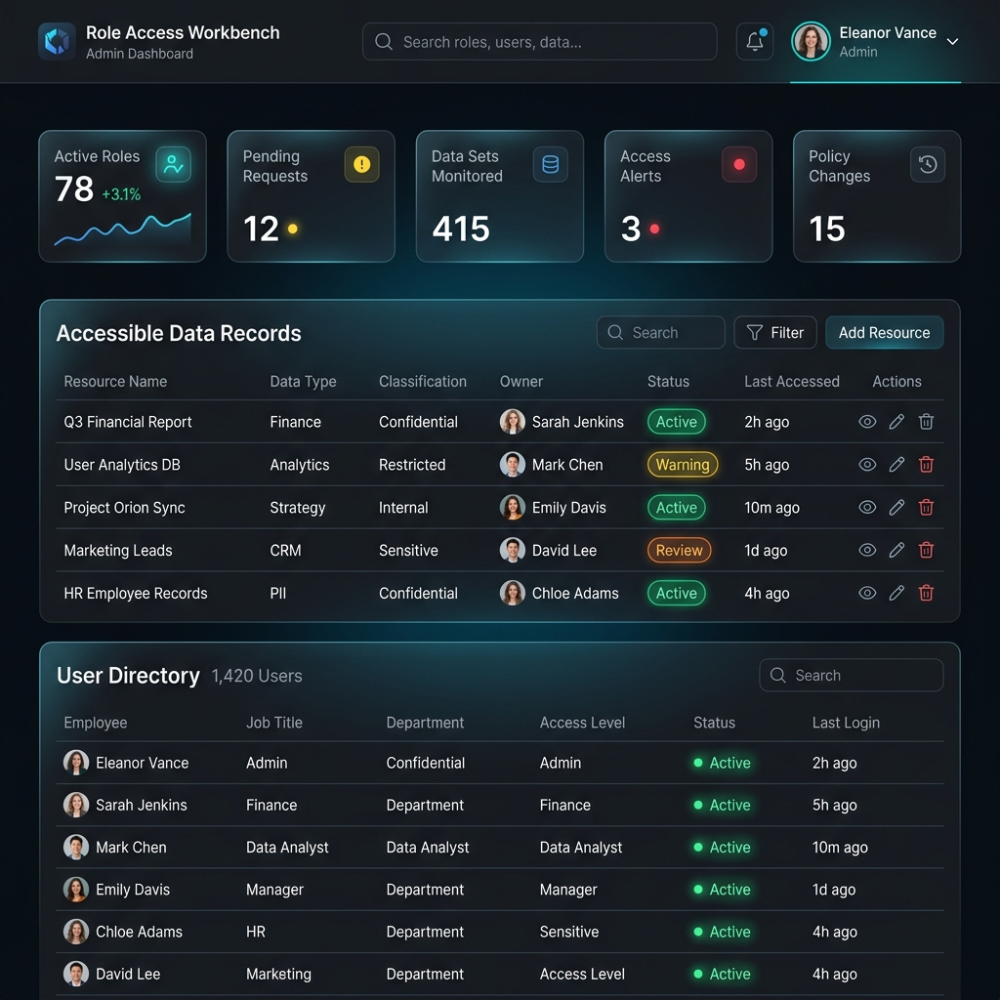
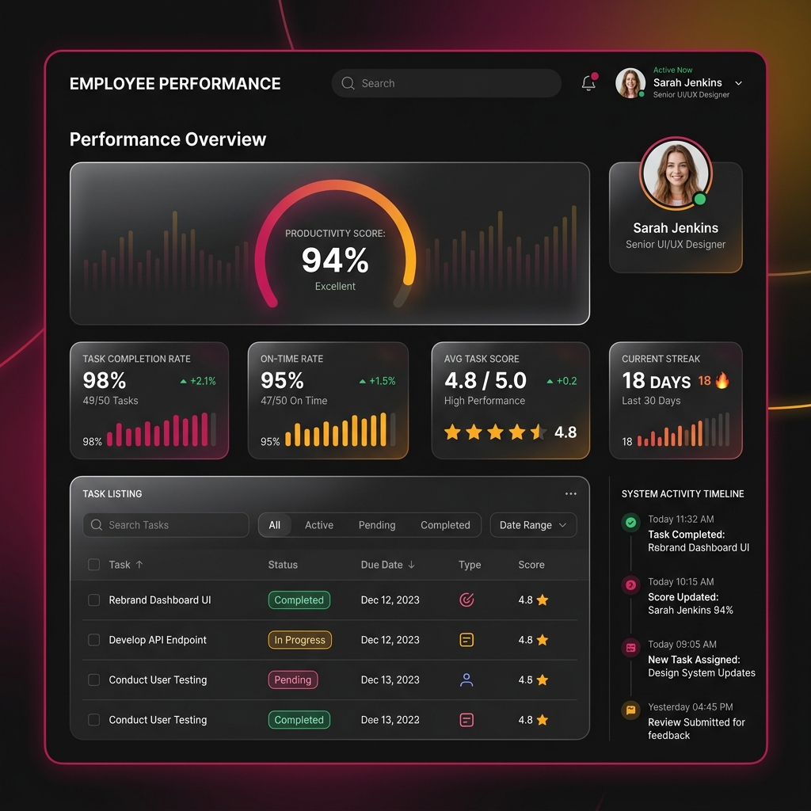

# 🔐 Role Access Workbench

An advanced, premium-tier single-page application built with **Angular 20** and a **TypeScript Node.js API**. The system implements secure role-scoped records access, real-time database modifications, and an interactive employee performance dashboard, backed by a local XML database layer.

---

## 🎨 System Previews & Features

### 1. Main Interactive Dashboard
Featuring status metrics, live async latency slider, visual API node flow indicators, access legend, search-activated data tables, and an interactive **User Directory** quick-access dashboard.


### 2. Employee Performance & Task Profile
Allows administrators to click on any employee name inside the directory lists to inspect an detailed performance profile, complete with score dials, productivity cards (Streak, Delivery, Averages), filterable tasks table, and a dedicated audit log timeline.


---

## 🚀 Key Features & Architectural Scope

### Frontend Architecture (Angular 20)
*   **App Initialization session recovery:** Uses `APP_INITIALIZER` through `AppLoadService` to restore user auth tokens and validate sessions *before* routing occurs.
*   **Lazy-Loaded Modules:** Implements route-scoped lazy loading for improved startup budget compliance.
*   **Shared Design System Module:** Declares reusable layout components like the `app-spinner`, centralized `app-toast` notifications, customizable confirmation dialog panels (replacing unsafe native confirm triggers), and custom `RoleBadgePipe` decorators.
*   **Responsive Dark Mode aesthetics:** Styled with modern CSS grids, harmonized HSL variables, glassmorphic layout tiles, and scan-line background animations.

### Secure REST API Backend (Express + TypeScript)
*   **XML Data Adapter (`XmlStore`):** Safe file read/write pipeline utilizing `fast-xml-parser` acting as a localized database layer inside `server/data/users.xml`. Easily interchangeable with MongoDB or AWS DynamoDB.
*   **Asynchronous Processing Control:** Custom middleware that inspects requests and injects artificial delay based on user-controlled frontend latency controls. Includes frontend stopwatch indicators measuring elapsed roundtrip milliseconds.
*   **API Security & Tracing:**
    *   **CORS integration** supporting ports `4200` and `4201`.
    *   **X-Request-Id middleware** logging UUID parameters per request.
    *   **Input sanitization middleware** stripping layout breaking whitespaces.
    *   **Server-side Role verification** rejecting mismatched client token assertions.
*   **System Audit Logger:** Creates real-time JSON audit logs in `server/data/audit.json` mapping database operations (CREATE, UPDATE, DELETE, LOGIN) performed by admins, viewable through the Admin Console.

---

## 👥 Demo Accounts & Credentials

| Role | User ID | Password | Access Rights |
|---|---|---|---|
| **Admin** | `admin` | `admin123` | Full access to records, full user management CRUD, audit logs, and employee performance profiles. |
| **General User** | `general` | `general123` | Scoped read access (can only view owned records plus public records). |
| **General User** | `analyst` | `analyst123` | Scoped read access (can only view owned records plus public records). |

---

## 🛠️ Installation & Getting Started

### Prerequisites
Make sure you have **Node.js** installed on your system.

### Quick Setup

1.  **Clone or Open Workspace:** Ensure you are in the project folder.
2.  **Install dependencies:**
    ```bash
    npm install
    ```
3.  **Launch concurrent development servers:**
    ```bash
    npm start
    ```
    This script will concurrently start the backend Express server at `http://127.0.0.1:3000` and the frontend Angular CLI dev server at `http://127.0.0.1:4200` (automatically proxied through `proxy.conf.json`).

---

## 💻 Script Reference

| Script | Command | Purpose |
|---|---|---|
| `npm start` | `concurrently "npm:api" "npm:client"` | Runs both frontend and API backend in watch modes. |
| `npm run api` | `tsx watch server/server.ts` | Launches Node API server with live watch reload. |
| `npm run client` | `ng serve --host 127.0.0.1 --port 4200` | Boots frontend Angular client. |
| `npm run verify` | `npm run api:build && npm run build` | Compiles API TypeScript and runs production Angular build bundle. |
